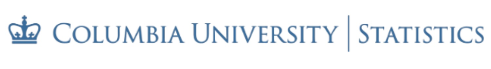

### STAT GR 6105 - Statistical Consulting and Collaborative Data Science
#### [Department of Statistics](https://stat.columbia.edu/), [Columbia University](https://www.columbia.edu/)
#### Fall 2024

#### Course Information

* Classes: Mondays 9:00am-11:00am
* Walk-in consulting clinics: TBD
* Room: 1025 SSW
* Instructors:
	* [Tian Zheng](http://www.stat.columbia.edu/~tzheng/): <tian.zheng@columbia.edu> [(@tz33cu)](https://github.com/tz33cu)
	* [Wayne Lee](https://leewtai.github.io/): <wtl2109@columbia.edu> [(@leewtai)](https://github.com/leewtai)
	* Office hours: by appointments. We will use our Monday class time to discuss consulting cases and assignments. 
	* Contact preference: email or courseworks
* Course websites (all accessible via courseworks): 
	* Course information and materials, assignments, grades, announcement and discussion on **Courseworks**: <http://courseworks2.columbia.edu>
	* Public assets on **GitHub**: <https://github.com/tz33cu/ColabDataScience-DesignStudio>

#### Prerequisites
The pre-requisite for this course includes working knowledge in Statistics and Probability, data mining, statistical modeling and machine learning (such as the 6101-6102 sequence + 6201). Prior **advanced** programming experience in R or Python is required. 

#### Description  
This course has two main components: 1) a consulting clinic where student consultants provide pro bono consulting service for Columbia community researchers under the supervision of the course's instructor(s), and 2) a project-based learning curriculum on collaborative data science covering topics from project scoping to the best practices of collaboration and reproducible data science. Both components challenge students to apply knowledge and skills covered in a statistical curriculum to real-world data science research projects. 

#### Course Objectives and Learning Outcomes
##### Objectives:

+ Hands-on experience in applying statistical knowledge to solve problems;
+ Skills and best practices in statistical consulting and collaborative data science;
+ Exposure to a variety of real data science problems.

##### Learning Outcomes
Students completing this course should be able to 

+ effectively communicate with clients (asking questions and listening) to ascertain the data science challenges;
+ formulate challenges into coherent data science problems, map out the data science workflow, and identify the relevant resources and tools; 
+ provide guidance, next steps, or simple solutions on the identified problems;
+ effectively communicate with clients orally *and* in writing (e.g., reports or scoped project proposals) to help them make progress with their research, and understand the statistical advice or solution and its relevance to their project.

#### Course organization

During the weekly class time on Mondays, the first half of the class (9am-10am) will be on topics related to the project-based learning component of the course: project release, tutorials, discussions and in-class presentations. The second half of the class (10am-11am) will be used to discuss activities related to the *Consulting Clinic*. 

Students will be encouraged to work in pairs for both the course's mini projects (see below) and the consulting clinic. 

##### Collaborative Data Science Mini Projects

1. (weeks 2-3) Prepare a plain language presentation of a classic statistical methodology; [In-class presentation]
2. (weeks 4-6) Read and summarize the statistics or machine learning method(s) used in a scientific paper. [In-class presentation]
3. (weeks 7-9) Present a current statistical application to an intro stat class. [In-class presentation as rehearsal]
4. (weeks 10-13) Reproduce an applied statistics paper. [Final project]

Below is a tentative schedule for Fall 2024 that we will follow.

+ Week 1 (Sep 9): Introduction and Class Organization
+ Week 2 (Sep 16): Consulting 101; Project 1 discussion.
+ Week 3 (Sep 23): Project 1 presentations
+ Week 4 (Sep 30): Scientific data science; Project 2 discussion.
+ Week 5 (Oct 7): Scientific data science; Project 2 discussion.
+ Week 6 (Oct 14): Project 2 presentations
+ Week 7 (Oct 21): Presenting Statistics; Project 3 discussion
+ Week 8 (Oct 28): Presenting Statistics; Project 3 rehearsals.
+ Week 9 (Nov 4): No Class
+ Week 10 (Nov 11): Reproducible data science; Project 4 discussion.
+ Week 11 (Nov 18): Reproducible data science; Project 4 discussion.
+ Week 12 (Nov 25): Reproducible data science; Project 4 discussion.
+ Week 13 (Nov 27): Reproducible data science; Project 4 discussion.
+ Week 14 (Dec 2): Project 4 presentations
+ Week 15 (Dec 9): Wrapping up.

##### Consulting Clinic
Starting in Week 2, students will work in pairs and work on consulting requests received via the department's [consulting webpage](https://stat.columbia.edu/consulting-information/). This may include scheduling meetings (in-person or virtual) with the clients, summarize and present the consulting request during class on Mondays, preparing and communicating recommendations, suggestions, next steps and/or solutions to the client. For each consulting request, the student consultants responsible are also required to complete a standard consulting report. 

#### Evaluation
Students will be evaluated for their performance on both the mini projects and the consulting clinic. 

* [60%] Mini projects products (instructor-reviewed and peer-reviewed; Projects 1-3 are 10% each and project 4 is 30%). Each project description will have explicit grading rubrics. 
* [20%] Consulting clinic (based on consulting tasks).
* [20%] Paricipation (based on instructors' observation).

	##### A note on participation evaluation. 
	* We will give participation score for each project cycle, the average of which will contribute to 20% of your final grade. The participation will be graded on the following curve. 
	
		* A (1.8-2): Major contributor who contribute substantially in every stage of the project and class discussions. 
		* A- (1.5-1.8): Active contributor who contributed substantially to some parts of the project and some discussions. *This is what most students receive for their participation.*
		* B+ (1.2-1.5): Average participation, participate in the discussion at every stage and contribute substentially in at least one part of the project and some discussions. 
		* B (1-1.2) or lower: below average performance.   
	* This is to ensure a positive learning process for all of us.  

#### Communication
All course assignments and grades are managed in courseworks. We will be using the discussion/announcement tools in Courseworks for class communication. The system is highly catered to exchanging ideas, discussing plans, and getting answers and help fast and efficiently from the instructional team and classmates. Rather than emailing questions to the teaching staff, we encourage you to post your questions online.

#### Textbooks
There is not a single required text. As part of this course, we will learn from what we can find online and in academic papers. Here are a couple of recommended reference books. 

+ Irizarry, R. A. (2019). Introduction to data science: Data analysis and prediction algorithms with R. Chapman and Hall/CRC. https://rafalab.dfci.harvard.edu/dsbook/
+ Wickham (2017) R for Data Science http://r4ds.had.co.nz/
+ Yu, B. and Barter, R. L. (2024) Veridical Data Science. https://vdsbook.com/
+ Venables, W. N., & Ripley, B. D. (2013). Modern applied statistics with S-PLUS. Springer Science & Business Media.

#### Class policy

* We learn together through discussion and projects. Please stay positive and congenial. Share what you know with your peers and also learn from them.

* Working towards deadlines can be stressful. Remember, emails or online posts do NOT have tones. Be mindful about how you phrase your questions, comments, inquries, and suggestions. Also be generous and forgiving when reading them. 

* As consultants, we need to be mindful of the fact that different disciplines have different jargons, norms, and culture. Be respectful and help create an inclusive environment for everyone.

* **Academic Integrity** is the cornerstone of meaningful teaching and learning. It is especially important for our project-based course. Remember what matters more is how much you learn not what grade you will get. In your project, document references and resources that have been incorporated into your project and accredit them appropriately. Plagiarism is one of the most likely form of cheating in this course. 

* Be a good team member and contribute to each project as much as you can. Don't underestimate the efforts of your classmates. Something seems simple may not be that simple. 

* Emails related to learning and projects shall be used minimally. Use the discussion board instead.

* Students are [expected](http://policylibrary.columbia.edu/student-email-communication-policy) to check emails at least once every 12 hours during the week and every 24 hours over the weekend. Students should make sure not to miss any important class-related announcements sent by emails or posted on Courseworks. Emails will be delivered to the students' official UNI. It is the students' responsibility to ensure that these emails are properly forwarded if they choose to use an alternative email address.
  
* If you have been certified by **Disability Services (DS)** to receive accommodations, please either bring your accommodation letter from DS to your professor’s office hours to confirm your accommodation needs, or ask your liaison in GSAS to consult with your professor. If you believe that you may have a disability that requires accommodation, please contact [Disability Services](https://www.health.columbia.edu/content/disability-services) at 212-854-2388 or disability@columbia.edu.
